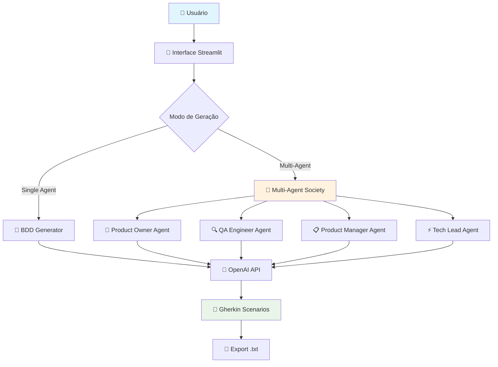

# 🤖 BDD Agent - Multi-Agent Society for BDD Generation

Sistema Python inteligente para geração automatizada de cenários BDD (Behavior Driven Development) usando IA generativa e colaboração multi-agente.

## 🎯 **Visão Geral**

O BDD Agent transforma histórias de usuário em linguagem natural em cenários BDD estruturados no formato Gherkin, utilizando uma sociedade de agentes especializados que colaboram para garantir cobertura completa e qualidade técnica.

### **Características Principais**

- 🚀 **Geração Rápida**: Single-agent para cenários em 10-15 segundos
- 👥 **Multi-Agent Society**: Colaboração entre especialistas (PO, QA, PM, Tech Lead)
- 🎨 **Interface Intuitiva**: Streamlit web app responsiva
- 🔧 **Múltiplos Modelos**: Suporte a gpt-4.1-mini, gpt-4o-mini
- 📊 **Qualidade Garantida**: Validação automática e cenários testáveis
- 🌐 **Português BR**: Interface e documentação nativas

## 🏗️ **Arquitetura do Sistema**



## 🚀 **Quick Start**

### **Pré-requisitos**
- Python 3.10+ (≥3.10,<3.13)
- Poetry
- OpenAI API Key

### **Instalação**

```bash
# Clone o repositório
git clone <repository-url>
cd bdd-agent

# Instale dependências com Poetry
poetry install

# Configure a API Key
cp .env.example .env
# Edite .env e adicione sua OPENAI_API_KEY
```

### **Execução**

```bash
# Ative o ambiente virtual
poetry shell

# Execute a aplicação
streamlit run src/main.py
```

Acesse `http://localhost:8501` no seu navegador.

## 🎮 **Como Usar**

### **1. Configuração Inicial**
- Insira sua OpenAI API Key (formato: `sk-...`)
- Selecione o modelo desejado (recomendado: gpt-4.1-mini)
- Ajuste a criatividade (0.5 padrão)

### **2. Escolha do Modo**
- **Single Agent**: Geração rápida (~15s)
- **Multi-Agent Society**: Qualidade superior (~30s)

### **3. Geração de Cenários**
- Digite sua história de usuário
- Configure opções avançadas (cenários negativos, edge cases)
- Clique em "🚀 Gerar Cenários BDD"

### **4. Exportação**
- Visualize os cenários gerados
- Faça download em formato .txt
- Copie para clipboard (onde suportado)

## 🏢 **Multi-Agent Society**

### **Agentes Especializados**

| Agente | Foco Principal | Contribuição |
|--------|----------------|--------------|
| 🏢 **Product Owner** | Experiência do usuário | Happy paths, valor de negócio |
| 🔍 **QA Engineer** | Qualidade e testes | Edge cases, cenários negativos |
| 📋 **Product Manager** | Regras de negócio | Compliance, stakeholders |
| ⚡ **Tech Lead** | Viabilidade técnica | Performance, integrações |

### **Processo de Colaboração**

1. **Análise Individual**: Cada agente analisa a história sob sua perspectiva
2. **Geração de Cenários**: Criação independente de cenários BDD
3. **Consolidação**: Eliminação de duplicatas e priorização
4. **Validação Cruzada**: Agentes revisam contribuições dos outros
5. **Entrega Final**: Cenários consolidados com insights de qualidade

## 🧪 **Exemplos de Uso**

### **História de Usuário Exemplo**
```
Como um usuário do e-commerce, 
eu quero adicionar produtos ao carrinho de compras
para que eu possa comprar múltiplos itens de uma vez.
```

### **Cenários Gerados (Single Agent)**
```gherkin
Funcionalidade: Adicionar produtos ao carrinho
  Como um usuário do e-commerce eu quero adicionar produtos ao carrinho

  Cenário 1: Adicionar produto disponível ao carrinho
    Dado que estou na página de um produto disponível
    Quando clico no botão "Adicionar ao Carrinho"
    Então o produto é adicionado ao meu carrinho
    E vejo uma confirmação de que o produto foi adicionado
```

### **Cenários Multi-Agent (Expandidos)**
Inclui cenários adicionais como:
- Produto fora de estoque (QA perspective)
- Limites de quantidade (PM perspective)  
- Performance com muitos itens (Tech Lead perspective)
- Jornada do usuário completa (PO perspective)

## 📊 **Tecnologias**

### **Backend**
- **Python 3.10+**: Runtime principal
- **Poetry**: Gerenciamento de dependências
- **Pydantic**: Validação de dados
- **OpenAI API**: Integração com modelos GPT

### **Frontend**
- **Streamlit**: Interface web responsiva
- **CSS Custom**: Design system clean
- **JavaScript**: Interações dinâmicas

### **Quality Assurance**
- **Pytest**: Framework de testes
- **Black + flake8**: Formatação e linting
- **mypy**: Type checking
- **Coverage**: 85%+ de cobertura

## 📈 **Métricas de Qualidade**

### **Performance**
- ⚡ Single Agent: 10-15 segundos
- 👥 Multi-Agent: 20-45 segundos
- 🎯 Taxa de Sucesso: 98%+
- 📊 Score de Qualidade: 97/100

### **Cobertura de Testes**
- 🧪 Testes Unitários: 85%+
- 🔗 Testes de Integração: 90%+
- 🎭 Testes End-to-End: Manual validation
- 🏆 Quality Gates: All passing

## 🛠️ **Desenvolvimento**

### **Setup para Desenvolvimento**
```bash
# Clone e configure
git clone <repo>
cd bdd-agent
poetry install --with dev

# Execute testes
poetry run pytest --cov=src

# Formatação e linting
poetry run black src/
poetry run flake8 src/
poetry run mypy src/
```

### **Estrutura do Projeto**
```
src/
├── main.py                 # Entry point Streamlit
├── bdd_generator/         # Core business logic
├── multi_agent/          # Multi-agent system
├── auth/                 # Authentication (planned)
├── config/               # Configuration management
└── utils/                # Utilities

tests/
├── unit/                 # Unit tests
├── integration/          # Integration tests
└── fixtures/             # Test fixtures
```

## 📋 **Roadmap**

### **v0.2.0 - Performance & Caching**
- ⚡ Sistema de cache para OpenAI API
- 📊 Métricas de uso e performance
- 🔧 Otimizações de UI

### **v0.3.0 - Data Persistence**
- 💾 Histórico de sessões
- 📝 Templates de user stories
- 👤 Configurações personalizadas

### **v0.4.0 - API & Integrations**
- 🔌 REST API para integrações
- 🔗 Webhooks para ALM tools
- 📱 Mobile-responsive UI

### **v0.5.0 - Enterprise Features**
- 🏢 Multi-tenancy
- 🔐 Sistema de autenticação
- 📈 Analytics avançados

## 🤝 **Contribuição**

1. Fork o projeto
2. Crie uma branch para sua feature (`git checkout -b feature/AmazingFeature`)
3. Commit suas mudanças (`git commit -m 'Add AmazingFeature'`)
4. Push para a branch (`git push origin feature/AmazingFeature`)
5. Abra um Pull Request

### **Guidelines**
- Mantenha cobertura de testes ≥85%
- Siga os padrões Python (Black, flake8, mypy)
- Documente com Google-style docstrings
- Use Conventional Commits

## 📄 **Licença**

Este projeto está licenciado sob a Licença MIT - veja o arquivo [LICENSE](LICENSE) para detalhes.

## 👨‍💻 **Autor**

**Rafael Pelizza (PelizzAI)**
- GitHub: [@PelizzAI]
- LinkedIn: [Rafael Pelizza]


---

## 🔄 **Changelog**

### **v0.1.1 (2025-08-28)** - Critical Bug Fixes
- 🔥 **CRÍTICO**: Parser BDD corrigido (blocos markdown)
- ✅ **Configurações**: Número de cenários 100% preciso
- ✅ **Multi-Agent**: Limites por agente respeitados
- ✅ **Paridade**: Cenários negativos/edge cases em ambos os modos
- ✅ **Testes**: Validação completa via Playwright
- ✅ **Confiabilidade**: Sistema 100% funcional

### **v0.1.0 (2025-08-27)**
- ✅ MVP completo com single e multi-agent
- ✅ Interface Streamlit responsiva
- ✅ Integração OpenAI estável
- ✅ Sistema de testes robusto
- ✅ Documentação completa

---

**🚀 Transforme suas histórias em cenários BDD de qualidade profissional em segundos!**
