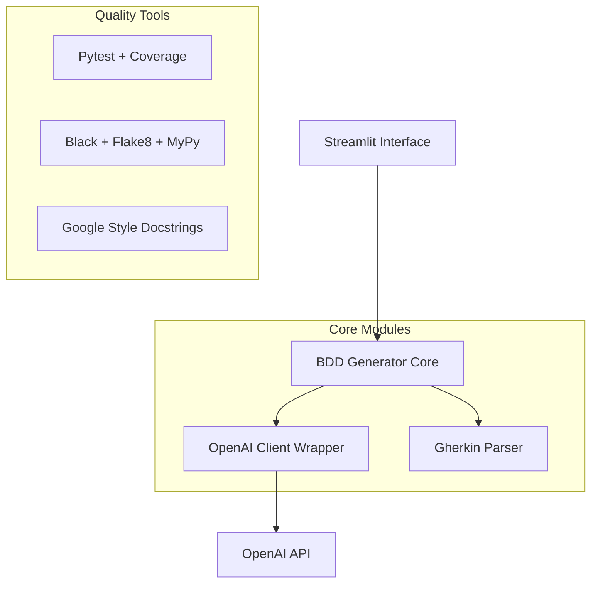

# 🧪 BDD Agent - Gerador Inteligente de Cenários BDD

Sistema Python para geração automatizada de cenários BDD (Behavior Driven Development) utilizando Inteligência Artificial.

## 🚀 Tecnologias Utilizadas

### Stack Principal
- **Python 3.9+** - Linguagem base com tipagem estrita
- **Streamlit 1.28.0** - Interface web responsiva
- **OpenAI API 1.3.0** - Integração com modelos de IA
- **Pydantic 2.5.0** - Validação de dados e tipos
- **Poetry** - Gerenciamento de dependências

### Ferramentas de Desenvolvimento
- **Pytest** - Framework de testes com coverage
- **Black + Flake8 + MyPy** - Code quality e linting
- **isort** - Organização de imports

## 📋 Funcionalidades

### ✅ Core Features
- **Interface Intuitiva**: Streamlit com layout responsivo
- **IA Avançada**: Múltiplos modelos OpenAI (GPT-4o-mini, GPT-4-turbo)
- **Geração Inteligente**: Cenários positivos, negativos e casos extremos
- **Parser Gherkin**: Estruturação automática de cenários BDD
- **Export Direto**: Download de arquivos .feature prontos para uso

### 🎯 Características Técnicas
- **Tipagem Estrita**: 100% MyPy compliance
- **Tratamento de Erros**: Logging estruturado e timeout management
- **Validação Robusta**: API keys e inputs com feedback em tempo real
- **Configurações Avançadas**: Temperatura IA, quantidade de cenários

## 🏗️ Arquitetura



### Estrutura do Projeto
```
src/
├── main.py                 # Entry point Streamlit
├── bdd_generator/         # Core BDD logic
│   ├── generator.py       # Orquestração da geração
│   └── openai_client.py   # Wrapper OpenAI API
├── auth/                  # Autenticação (futuro)
├── config/                # Configurações centralizadas
├── ui/                    # Componentes UI reutilizáveis
└── utils/                 # Utilitários compartilhados

tests/
├── conftest.py           # Fixtures globais
├── unit/                 # Testes unitários
└── integration/          # Testes de integração
```

## 🛠️ Instalação e Uso

### Pré-requisitos
- Python 3.9 ou superior (exceto 3.9.7)
- Poetry instalado
- Chave da API OpenAI

### Instalação
```bash
# Clone o repositório
git clone <repository-url>
cd bdd-agent

# Instalar dependências
poetry install

# Ativar ambiente virtual
poetry shell
```

### Configuração
```bash
# Criar arquivo .env (opcional)
echo "OPENAI_API_KEY=sk-your-api-key-here" > .env
```

### Execução
```bash
# Executar aplicação
streamlit run src/main.py

# Executar testes
pytest --cov=src --cov-report=html

# Code quality check
black src/ && flake8 src/ && mypy src/
```

## 📊 Exemplo de Uso

### Input - História do Usuário
```
Como um usuário do sistema de e-commerce,
eu quero adicionar produtos ao carrinho de compras,
para que eu possa revisar minha seleção antes da compra.
```

### Output - Cenários BDD Gerados
```gherkin
Funcionalidade: Adicionar produtos ao carrinho
  Como um usuário do sistema de e-commerce
  Eu quero adicionar produtos ao carrinho de compras
  Para que eu possa revisar minha seleção antes da compra

  Cenário: Adicionar produto disponível com sucesso
    Dado que estou na página do produto "Smartphone Galaxy"
    E o produto tem estoque disponível
    Quando eu clico no botão "Adicionar ao Carrinho"
    Então o produto deve ser adicionado ao carrinho
    E devo ver a mensagem "Produto adicionado com sucesso"

  Cenário: Tentar adicionar produto sem estoque
    Dado que estou na página do produto "Notebook Dell"
    E o produto está fora de estoque
    Quando eu clico no botão "Adicionar ao Carrinho"
    Então devo ver a mensagem "Produto indisponível"
    E o produto não deve ser adicionado ao carrinho
```

## 🔧 Configurações Avançadas

### Modelos OpenAI Suportados
- **gpt-4o-mini** (padrão) - Custo otimizado
- **gpt-4-turbo** - Performance superior
- **gpt-3.5-turbo** - Compatibilidade

### Parâmetros Configuráveis
- **Criatividade**: 0.0 (conservador) a 1.0 (criativo)
- **Quantidade**: 1 a 20 cenários por história
- **Tipos**: Positivos, negativos, casos extremos
- **Timeout**: 30s para requisições OpenAI

## 🧪 Qualidade e Testes

### Métricas de Qualidade
- **Cobertura de Testes**: ≥85% configurado
- **Type Coverage**: 100% MyPy strict mode
- **Code Style**: Black + Flake8 compliance
- **Documentation**: Google-style docstrings obrigatórias

### Executar Testes
```bash
# Testes com coverage
pytest --cov=src --cov-report=term-missing --cov-report=html

# Ver relatório HTML
open htmlcov/index.html

# Testes específicos
pytest tests/unit/ -v
pytest tests/integration/ -v
```

## 📈 Roadmap

### ✅ MVP Atual (v0.1.0)
- Interface Streamlit funcional
- Integração OpenAI completa
- Geração BDD estruturada
- Export de arquivos .feature

### 🔄 Próximas Versões
- **v0.2.0**: Sistema de autenticação e histórico
- **v0.3.0**: Templates personalizáveis e cache
- **v0.4.0**: API REST para integração externa
- **v1.0.0**: Dashboard analytics e colaboração

## 🤝 Contribuição

### Desenvolvimento Local
```bash
# Configurar ambiente de desenvolvimento
poetry install --dev

# Executar quality checks
poetry run black src/
poetry run isort src/
poetry run flake8 src/
poetry run mypy src/

# Executar testes
poetry run pytest
```

### Padrões de Código
- **Tipagem**: Obrigatória em todas as funções
- **Docstrings**: Google style para funções públicas
- **Imports**: Organizados com isort
- **Line Length**: 88 caracteres (Black default)

## 📄 Licença

Este projeto está licenciado sob a MIT License - veja o arquivo [LICENSE](LICENSE) para detalhes.

## 👨‍💻 Autor

**Rafael Pelizza (PelizzAI)**
- Especialista em desenvolvimento Python e IA
- Foco em ferramentas que democratizam tecnologia

---

## 📊 Changelog

### v0.1.0 (2025-08-27)
- ✅ **Interface Streamlit**: Layout responsivo com configurações avançadas
- ✅ **OpenAI Integration**: Suporte a múltiplos modelos com validação robusta
- ✅ **BDD Generator**: Parsing Gherkin e classificação automática de cenários
- ✅ **Quality Tools**: Black, Flake8, MyPy, Pytest configurados
- ✅ **Documentation**: Docstrings completas e README técnico

### Melhorias Técnicas Implementadas
- Validação de API key em tempo real com feedback visual
- Sistema de timeout e error handling robusto
- Logging estruturado para debugging e monitoramento
- Arquitetura modular com separação clara de responsabilidades
- Configuração rigorosa de quality tools para código production-ready

---

**🎯 BDD Agent**: Transformando histórias de usuário em testes estruturados através do poder da Inteligência Artificial.
