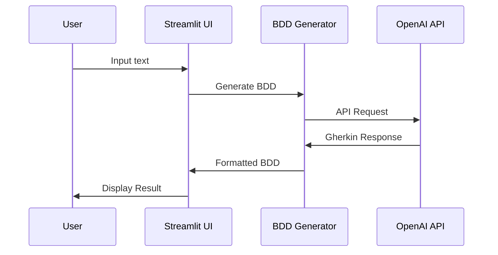
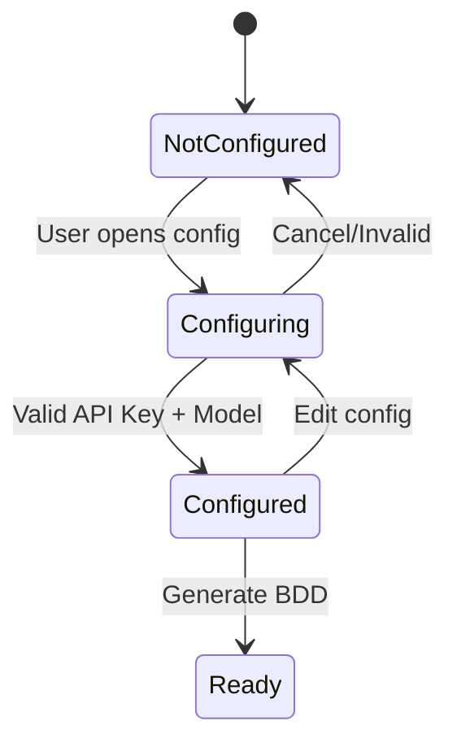

# 🏗️ System Patterns - BDD Agent

**Última atualização:** 2024-12-19 14:30:00

---

## 🎯 **Arquitetura Geral**

### **Padrão Arquitetural:** Modular Monolith
```
bdd-agent/
├── src/
│   ├── auth/              # Módulo de autenticação
│   ├── config/            # Módulo de configurações
│   ├── bdd_generator/     # Módulo gerador BDD
│   ├── ui/                # Módulo interface Streamlit
│   └── utils/             # Utilitários compartilhados
├── tests/                 # Testes automatizados
├── docs/                  # Documentação
└── pyproject.toml         # Configuração Poetry
```

## 🔧 **Padrões de Design**

### **1. Separation of Concerns**
- **Auth Module:** Responsável apenas por autenticação
- **Config Module:** Gerencia configurações e persistência
- **BDD Generator:** Lógica de geração via IA
- **UI Module:** Interface e navegação Streamlit

### **2. Dependency Injection**
```python
class BDDGenerator:
    def __init__(self, openai_client, config_manager):
        self.client = openai_client
        self.config = config_manager
```

### **3. Factory Pattern**
```python
class OpenAIClientFactory:
    @staticmethod
    def create_client(api_key: str, model: str):
        return OpenAI(api_key=api_key, model=model)
```

### **4. State Management Pattern**
```python
class SessionManager:
    def __init__(self):
        self.state = st.session_state
    
    def get(self, key: str, default=None):
        return self.state.get(key, default)
    
    def set(self, key: str, value):
        self.state[key] = value
```

## 🔐 **Padrões de Segurança**

### **1. Credential Management**
- API Keys armazenadas em session_state (não em arquivos)
- Validação de entrada para prevenir injection
- Sanitização de dados antes de envio para IA

### **2. Authentication Pattern**
```python
def require_auth(func):
    def wrapper(*args, **kwargs):
        if not st.session_state.get('authenticated', False):
            st.error("Acesso negado")
            return
        return func(*args, **kwargs)
    return wrapper
```

## 📊 **Padrões de Dados**

### **1. Configuration Schema**
```python
@dataclass
class AppConfig:
    openai_api_key: str = ""
    selected_model: str = "gpt-4o-mini"
    custom_model: str = ""
    
    def is_valid(self) -> bool:
        return bool(self.openai_api_key and 
                   (self.selected_model or self.custom_model))
```

### **2. BDD Response Schema**
```python
@dataclass
class BDDResponse:
    scenarios: List[str]
    raw_response: str
    model_used: str
    timestamp: datetime
```

## 🎨 **Padrões de Interface**

### **1. Page Navigation Pattern**
```python
class PageManager:
    PAGES = {
        "login": LoginPage,
        "main": MainPage,
        "config": ConfigPage
    }
    
    def render_page(self, page_name: str):
        page_class = self.PAGES.get(page_name)
        if page_class:
            page_class().render()
```

### **2. Component Pattern**
```python
class StreamlitComponent:
    def render(self):
        raise NotImplementedError
    
    def validate(self) -> bool:
        return True
```

## 🔄 **Padrões de Fluxo**

### **1. Request-Response Flow**


### **2. Configuration Flow**


## 🧪 **Padrões de Teste**

### **1. Test Structure**
```
tests/
├── unit/
│   ├── test_auth.py
│   ├── test_config.py
│   └── test_bdd_generator.py
├── integration/
│   └── test_openai_integration.py
└── fixtures/
    └── sample_responses.py
```

### **2. Mock Pattern**
```python
@pytest.fixture
def mock_openai_client():
    with patch('openai.OpenAI') as mock:
        mock.return_value.chat.completions.create.return_value = \
            MockResponse("Given...When...Then...")
        yield mock
```

## 📝 **Padrões de Documentação**

### **1. Docstring Pattern**
```python
def generate_bdd(self, user_input: str) -> BDDResponse:
    """
    Gera cenários BDD a partir de entrada do usuário.
    
    Args:
        user_input: Descrição em linguagem natural
        
    Returns:
        BDDResponse com cenários gerados
        
    Raises:
        ConfigurationError: Se API key não configurada
        OpenAIError: Se erro na chamada da API
    """
```

### **2. Error Handling Pattern**
```python
class BDDAgentError(Exception):
    """Base exception para BDD Agent"""
    pass

class ConfigurationError(BDDAgentError):
    """Erro de configuração"""
    pass

class OpenAIError(BDDAgentError):
    """Erro na integração OpenAI"""
    pass
```

## 🔍 **Padrões de Logging**

### **1. Structured Logging**
```python
import logging

logger = logging.getLogger(__name__)

def log_bdd_generation(user_input: str, model: str, success: bool):
    logger.info(
        "BDD Generation",
        extra={
            "input_length": len(user_input),
            "model": model,
            "success": success,
            "timestamp": datetime.now().isoformat()
        }
    )
```

---

## 🎯 **Decisões Arquiteturais**

### **ADR-001: Streamlit para Interface**
- **Status:** Aceito
- **Contexto:** Necessidade de interface rápida e simples
- **Decisão:** Usar Streamlit para prototipagem rápida
- **Consequências:** Interface limitada mas desenvolvimento ágil

### **ADR-002: Session State para Persistência**
- **Status:** Aceito
- **Contexto:** Simular localStorage em aplicação web
- **Decisão:** Usar st.session_state para dados temporários
- **Consequências:** Dados perdidos ao fechar navegador

### **ADR-003: Modular Architecture**
- **Status:** Aceito
- **Contexto:** Facilitar manutenção e testes
- **Decisão:** Separar responsabilidades em módulos
- **Consequências:** Maior complexidade inicial, melhor manutenibilidade

---

**Padrões Implementados:** 0/10
**Próxima Revisão:** Após implementação inicial