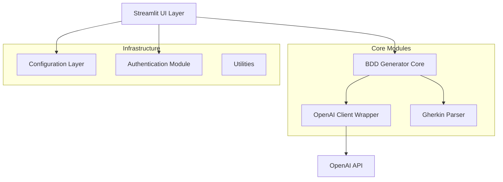

# 🏗️ System Patterns - BDD Agent

**Última atualização:** 2025-08-27 16:19:05

---

## 🎯 **Arquitetura e Padrões de Design**

### **Arquitetura Geral**


---

## 🏛️ **Padrões Arquiteturais Identificados**

### **1. Layered Architecture (Arquitetura em Camadas)**
```python
# Camada de Apresentação (UI)
src/ui/
├── components/     # Componentes reutilizáveis
└── pages/         # Páginas específicas

# Camada de Aplicação (Business Logic)
src/bdd_generator/
├── generator.py    # Orquestração da geração BDD
└── openai_client.py # Integração com IA

# Camada de Infraestrutura
src/config/        # Configurações
src/auth/          # Autenticação
src/utils/         # Utilitários
```

### **2. Wrapper Pattern**
```python
# OpenAI Client Wrapper - Encapsula complexidade da API
class OpenAIClientWrapper:
    def __init__(self, config: OpenAIConfig)
    def create_completion(self, messages: list) -> str
    def validate_api_key(self) -> bool
    def get_model_info(self) -> Dict
```

### **3. Factory Pattern**
```python
# Configuration Factory para diferentes tipos de modelos
SUPPORTED_MODELS = {
    "gpt-4o-mini": {"name": "GPT-4o Mini", "max_tokens": 4096},
    "gpt-4.1-mini": {"name": "GPT-4.1 Mini", "max_tokens": 4096},
    # ... mais modelos
}
```

---

## 🧩 **Decisões Arquiteturais Principais**

### **DA001 - Pydantic para Validação**
```python
class BDDScenario(BaseModel):
    title: str = Field(..., description="Título do cenário")
    steps: List[str] = Field(..., description="Lista de passos do cenário")
    scenario_type: str = Field(default="positive", description="Tipo do cenário")
```
**Razão**: Validação de tipos em runtime, documentação automática, integração com FastAPI futuro

### **DA002 - Streamlit como Interface**
```python
# Escolha de Streamlit vs Flask/FastAPI
st.set_page_config(
    page_title="BDD Agent - Gerador de Cenários",
    page_icon="🧪",
    layout="wide"
)
```
**Razão**: Prototipagem rápida, foco em UX científica, menos código boilerplate

### **DA003 - Separação de Responsabilidades**
```python
# Generator (Orquestração) != Client (Comunicação)
class BDDGenerator:
    def __init__(self, api_key: str, model: str)
    def generate_scenarios(self, user_story: str) -> BDDResponse

class OpenAIClientWrapper:
    def create_completion(self, messages: list) -> str
```
**Razão**: Single Responsibility Principle, testabilidade, flexibilidade para trocar providers IA

### **DA004 - Tratamento de Erros Centralizado**
```python
try:
    response = self.client.chat.completions.create(...)
    # Process response
except Exception as e:
    logger.error(f"Erro ao gerar cenários BDD: {str(e)}")
    raise
```
**Razão**: Logging estruturado, user feedback adequado, debugging facilitado

---

## 🎨 **Padrões de Design Implementados**

### **1. Command Pattern (Implícito)**
```python
# Cada geração é um comando encapsulado
def generate_bdd_scenarios(user_story: str, config: Dict) -> str:
    # Configurar cliente OpenAI
    # Criar gerador BDD  
    # Gerar cenários
    # Formatar resposta
```

### **2. Template Method Pattern**
```python
def _create_system_prompt(self) -> str:
    """Template fixo para prompts do sistema"""
    
def _create_user_prompt(self, user_story: str, options...) -> str:
    """Template variável baseado em parâmetros"""
```

### **3. Strategy Pattern (Parsing)**
```python
def _determine_scenario_type(self, title: str, steps: List[str]) -> str:
    """Estratégias diferentes para classificar cenários"""
    if any(keyword in title_lower for keyword in negative_keywords):
        return "negative"
    elif any(keyword in title_lower for keyword in edge_keywords):
        return "edge_case"
    else:
        return "positive"
```

### **4. Builder Pattern (Response Construction)**
```python
return BDDResponse(
    feature_name=feature_name,
    feature_description=feature_description,
    scenarios=scenarios,
    gherkin_content=gherkin_content,
)
```

---

## 🔧 **Configurações e Convenções**

### **Naming Conventions**
```python
# Classes: PascalCase
class BDDGenerator, OpenAIClientWrapper, BDDScenario

# Métodos: snake_case
def generate_scenarios(), create_completion(), validate_api_key()

# Constantes: UPPER_SNAKE_CASE  
SUPPORTED_MODELS, DEFAULT_TEMPERATURE

# Arquivos: snake_case
generator.py, openai_client.py, conftest.py
```

### **Code Quality Patterns**
```toml
# pyproject.toml - Configurações rigorosas
[tool.mypy]
disallow_untyped_defs = true
disallow_incomplete_defs = true
strict_equality = true

[tool.black]
line-length = 88
target-version = ['py39']

[tool.pytest.ini_options]
addopts = "--strict-markers --cov=src --cov-report=term-missing"
```

### **Logging Pattern**
```python
import logging
logger = logging.getLogger(__name__)

# Logs estruturados com contexto
logger.info(f"Gerando {num_scenarios} cenários BDD para: {user_story[:50]}...")
logger.error(f"Erro ao gerar cenários BDD: {str(e)}")
```

---

## 🚀 **Padrões de Performance**

### **1. Timeout Management**
```python
response = self.client.chat.completions.create(
    model=self.model,
    messages=messages,
    timeout=self.config.timeout,  # 30s default
)
```

### **2. Token Usage Logging**
```python
usage = response.usage
if usage:
    logger.info(
        f"Tokens usados - Prompt: {usage.prompt_tokens}, "
        f"Completion: {usage.completion_tokens}"
    )
```

### **3. Caching Strategy (Futuro)**
```python
# TODO: Implementar cache para cenários similares
# Pattern identificado para futuras otimizações
```

---

## 🧪 **Padrões de Teste**

### **Test Structure**
```python
# conftest.py - Fixtures centralizadas
@pytest.fixture
def mock_openai_client() -> Mock:
    """Cliente OpenAI mockado para testes"""

@pytest.fixture  
def sample_user_story() -> str:
    """História de usuário padrão para testes"""
```

### **Mocking Pattern**
```python
mock_client = Mock()
mock_client.chat.completions.create.return_value = Mock(
    choices=[Mock(message=Mock(content="Cenário BDD exemplo"))]
)
```

### **Coverage Requirements**
```toml
# Cobertura obrigatória configurada
addopts = "--cov=src --cov-report=term-missing --cov-report=html"
```

---

## 📚 **Documentação Patterns**

### **Docstring Standard (Google Style)**
```python
def generate_scenarios(
    self,
    user_story: str,
    num_scenarios: int = 3,
    include_negative: bool = True,
) -> BDDResponse:
    """Gera cenários BDD a partir de uma história do usuário.

    Args:
        user_story: História do usuário em linguagem natural
        num_scenarios: Número de cenários a gerar
        include_negative: Se deve incluir cenários negativos

    Returns:
        BDDResponse com os cenários gerados

    Raises:
        Exception: Se houver erro na chamada da API
    """
```

### **Type Hints Obrigatórios**
```python
from typing import List, Dict, Optional
from pydantic import BaseModel, Field
```

---

## 🔒 **Security Patterns**

### **API Key Validation**
```python
def _validate_api_key_format(self, api_key: str) -> bool:
    """Valida formato básico da API key"""
    cleaned_key = api_key.strip()
    return cleaned_key.startswith('sk-') and len(cleaned_key) >= 20
```

### **Input Sanitization**
```python
# Limpeza de inputs na UI
if api_key_input:
    cleaned_key = api_key_input.strip()
    if cleaned_key.startswith('sk-') and len(cleaned_key) >= 20:
        api_key = cleaned_key
```

---

## 🎯 **Anti-Patterns Evitados**

### **❌ God Class**
- Classes com responsabilidades bem definidas
- BDDGenerator foca apenas em orquestração
- OpenAIClientWrapper apenas em comunicação

### **❌ Magic Numbers**
```python
# ✅ Constantes bem definidas
DEFAULT_MAX_TOKENS = 2000
DEFAULT_TEMPERATURE = 0.3
DEFAULT_TIMEOUT = 30
```

### **❌ String Concatenation**
```python
# ✅ Template strings e f-strings
prompt = f"""Gere {num_scenarios} cenários BDD para a seguinte história:

{user_story}"""
```

---

## 🔄 **Evoluções Futuras Identificadas**

### **Patterns para Implementar**
1. **Observer Pattern**: Para notificações de progresso
2. **Chain of Responsibility**: Para pipeline de processamento
3. **Decorator Pattern**: Para features opcionais
4. **Repository Pattern**: Para persistência de dados

### **Refactorings Planejados**
1. **Extract Interface**: Para tornar BDDGenerator testável
2. **Dependency Injection**: Para configurações flexíveis
3. **Event Sourcing**: Para auditoria de gerações
4. **Circuit Breaker**: Para robustez na API OpenAI

---

**🏗️ ARQUITETURA**: Sistema bem estruturado seguindo princípios SOLID, com separação clara de responsabilidades e patterns adequados para um MVP escalável.
